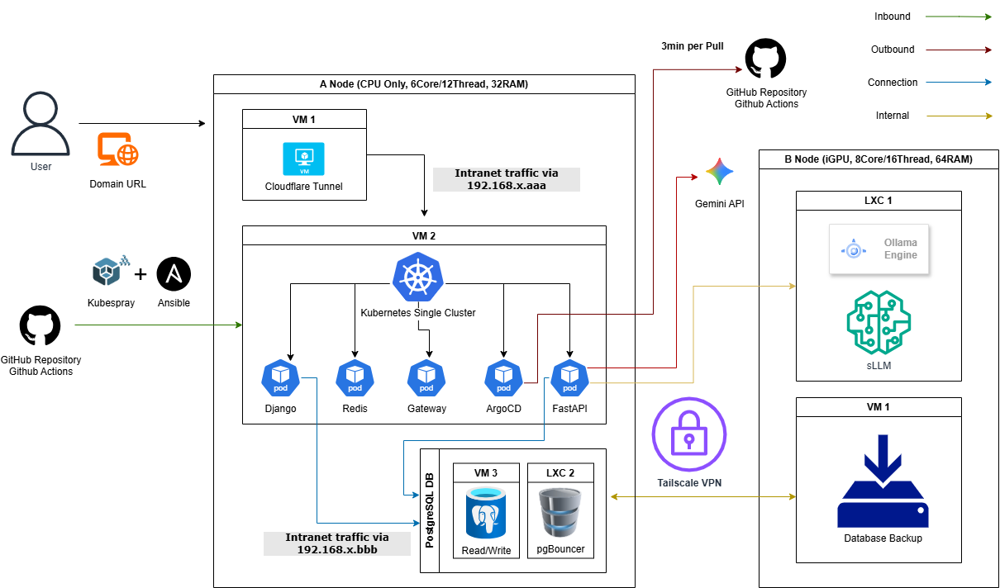

# haema's Home Lab

## 📊 Project Roadmap & Variance Analysis (Updated: 2026-02-06)

| Stage                        | Planned         | Actual               | Variance | Delay Analysis & Action Items                                      |
| :--------------------------- | :-------------- | :------------------- | :------: | :----------------------------------------------------------------- |
| **01. System Design**        | Jan 16 - Jan 19 | Jan 16 - Jan 19 |    0d    | **[Complete]** Architecture finalized for fixed hardware baseline.   |
| **02. DevOps & Environment** | Jan 23 - Jan 24 | Jan 26 - Jan 29 |    5d    | **[Cause & Complete]** Changes to Kubernetes via Kubespray           |
| **03. Model Evaluation** | Jan 30 - Jan 31 | Jan 30 - Feb 05 | 5d | **[Cause & Complete]** iGPU passthrough (c5:00.0)<br>**[Complete]** Qwen2.5 + bge models selected |
| **04. Development** | Feb 07 - Feb 27 | Feb 07 - **Ongoing** | - | - |

> **Current Status:** 🏗️ Stage 04 (Development) in progress.

---

## 🏛️ System Architecture



## ⚙️ Infrastructure Constraints & Design Decisions

**Hardware Topology**:

- **Compute Node (A)**: 6-core CPU, 12 threads, 32GB RAM (Kubernetes control plane + application workloads)
- **Inference Node (B)**: 8-core CPU, 16 threads, 64GB RAM, iGPU
  (Model serving + local LLM inference)
- **Constraint**: Both nodes are fixed in specs; no cloud spillover for training. 

**Cost-Sensitive Engineering**:

- **Local Processing**: sLLM handles summarization and RAG embeddings
- **API Generation**: Gemini API called only for final text generation
- **Result**: Significant cost savings vs. 100% cloud inference

## 🛠️ Technology Stack & Tooling

- **Virtualization**: Proxmox VE (iGPU Passthrough)
- **Orchestration**: Kubernetes via Kubespray/Ansible
- **Network & Access**: Tailscale (Mesh VPN)
- **CI/CD & GitOps**: GitHub Actions, ArgoCD
- **Monitoring**: Proxmox & ArgoCD & Discord Webhook
- **MLOps Pipeline**: Apache Airflow (Batch) + Ollama + FastAPI
- **Model**: BGE-M3, EXAONE-3.5:7.8B, Qwen2.5:14B, Gemini 2.5 Pro (API)
- **Langauge & Framework**: Python, Django, FastAPI, Kotlin, Spring Boot
- **Database**: Redis (Caching), PostgreSQL + PGVector

## 📁 Folder Architecture
```bash
repo/
  ├── .github/workflows/
  │             ├── bootstrap.yaml           # Kubespray → k8s + Ansible
  │             ├── argocd-setup.yaml        # ArgoCD
  │             ├── deploy-gateway.yml
  │             ├── deploy-frontend.yml
  │             ├── deploy-backend.yml
  │             └── deploy-models.yml
  │
  ├── apps/
  │     ├── gateway/    # Kotlin + Spring
  │     ├── frontend/   # Typescript + React
  │     ├── backend/    # Python + Django
  │     └── models/     # Python + FastAPI
  │
  ├── argocd/
  │     ├── gateway.yaml
  │     ├── frontend.yaml
  │     └── root-app.yaml
  │
  ├── manifests/
  │     ├── gateway/          # Kotlin + Spring
  │     ├── frontend/         # Typescript + React
  │     ├── backend/          # Python + Django
  │     └── models/           # Python + FastAPI
  │
  └── README.md
```

## 🎯 Key Challenges & Tasks

1. **Design and visualize** the overall service architecture to optimize limited local resources.
2. **Establish** a robust DevOps pipeline and environment setup for automated deployment.
