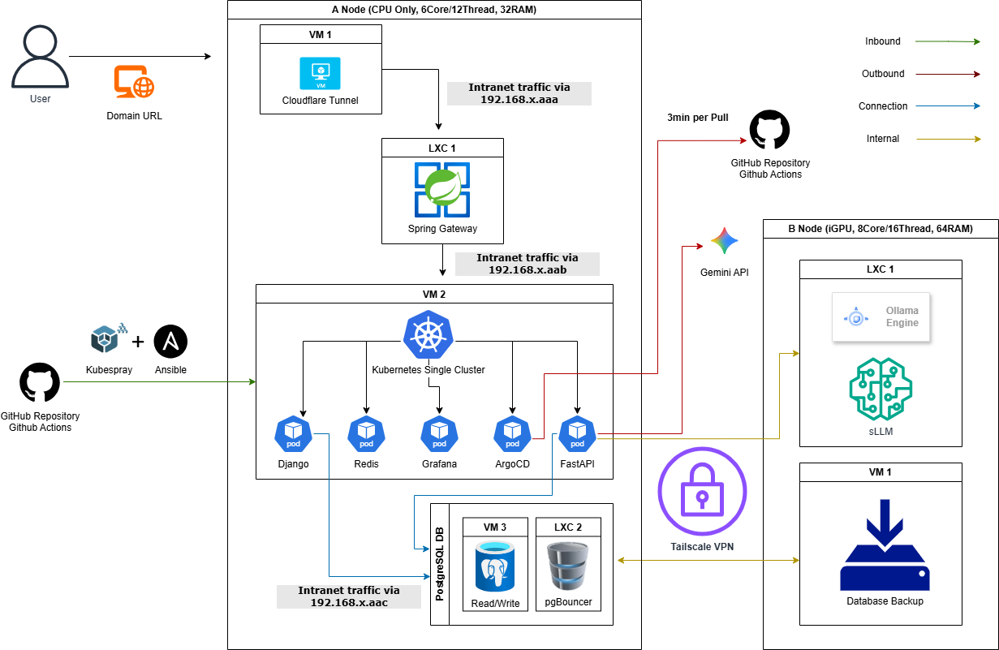

# haema's Home Lab

### 📊 Project Roadmap & Variance Analysis (Updated: 2026-01-20)

| Stage | Planned | Actual | Variance | Delay Analysis & Action Items |
| :--- | :--- | :--- | :---: | :--- |
| **01. System Design** | Jan 16 - Jan 19 | Jan 16 - Jan 19 | 0d | **[Complete]** Architecture finalized for fixed hardware baseline. |
| **02. DevOps & Environment** | Jan 20 - Jan 21 | Jan 20 - **Ongoing** | 0d | **[Status]** Configuring CI/CD pipelines. Currently on track. |

> **Current Status:** 🏗️ Stage 02 (DevOps & Environment) in progress.

---

## 🏛️ Service Architecture

## ⚙️ Infrastructure Constraints & Design Decisions

**Hardware Topology**: 
- **Compute Node (A)**: 6-core CPU, 12 threads, 32GB RAM (Kubernetes master + workload)
- **Inference Node (B)**: 8-core CPU, 16 threads, 64GB RAM, iGPU shared 3GB 
  (Model serving + local LLM inference [Gemma-2-3B via Ollama])
- **Constraint**: Both nodes are fixed in specs; no cloud spillover for training.

**Cost-Sensitive Engineering**: 
- **Local Processing**: Gemma-2-3B INT4 handles summarization and RAG embeddings
- **API Generation**: Gemini API called only for final text generation
- **Result**: Significant cost savings vs. 100% cloud inference

## 🛠️ Technology Stack & Tooling

- **Virtualization**: Proxmox VE
- **Orchestration**: Kubernetes (K8s)
- **CI/CD & GitOps**: GitHub Actions, ArgoCD
- **Monitoring**: Prometheus & Grafana Stack
- **MLOps & Serving**: [Ollama (local preprocessing: Gemma-2-3B INT4) / Gemini API (remote generation)]

## 🎯 Key Challenges & Tasks

1. **Design and visualize** the overall service architecture to optimize limited local resources.
2. **Establish** a robust DevOps pipeline and environment setup for automated deployment.