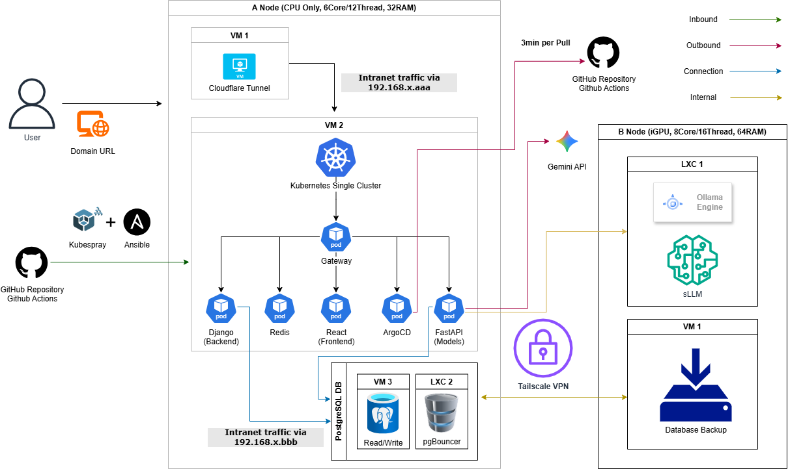

# haema's Home Lab

A verified RAG Q&A service over official economic data, built on two fixed home-lab nodes.
Every number in an answer is checked against its cited source before it is shown.

## 🏛️ System Architecture



> The diagram predates the redesign. See [Request Flow](#-request-flow) for the current design.

## 🔀 Request Flow

```
1. Browser → Cloudflare Tunnel → Gateway
2. Gateway ─ page requests → Frontend (static files)
           └ API requests  → Django API
3. Django API: validate input (≤ 300 chars)
   ├ plain DB lookup ───────────→ respond immediately
   ├ exact-match cache hit ─────→ respond immediately
   └ needs the model → Redis Streams (202 + job_id)   ← the only enqueue
4. Django worker (same image, LangGraph)
   ① FastAPI /embed           → question vector
   ② pgvector search (ORM)     → source documents + answer cache
   ③ close cached answer       → reuse it, skip generation
   ④ otherwise FastAPI /generate → qwen3.5:27b
   ⑤ code checks → FastAPI /judge (Gemini) → /fallback on failure
   ⑥ store answer + question vector from ①
   ⑦ write job result to Redis → frontend polls / receives status over SSE
```

**Boundaries**

- **Only Django touches PostgreSQL.** FastAPI holds no DB credentials, so a model-side failure or prompt injection cannot reach the database.
- **FastAPI is a stateless model gateway** for Ollama (Node B, over Tailscale) and the Gemini API.
- **Redis, FastAPI and ArgoCD are not routed through the Gateway.**
- Source documents are indexed by a batch job, never inside a user request. Generated answers live in a separate cache table and are never retrieved as evidence.

## ⚙️ Infrastructure Constraints & Design Decisions

**Hardware Topology**:

- **Compute Node (A)**: 6-core CPU, 12 threads, 32GB RAM (Proxmox: Cloudflare Tunnel VM, Kubernetes VM, PostgreSQL VM)
- **Inference Node (B)**: 8-core CPU, 16 threads, 64GB RAM, iGPU (Ollama in LXC)
- **Constraint**: Both nodes are fixed in specs; no cloud spillover for training.

**Measured Limits** (qwen3.5:27b on the iGPU, KV cache disabled per run):

| Metric | Value |
| :-- | :-- |
| Generation | ~4.5 tok/s |
| Prompt processing | ~70 tok/s (TTFT ≈ prompt tokens ÷ 70 s) |
| Short answer end-to-end | ~30 s (TTFT 12 s, 89 tokens) |
| Long RAG prompt (3,750 tokens) | TTFT 53 s, total 111 s |
| Reasoning mode on | 232 s for a 28-token question, 0 answer tokens (1,024-token cap reached) |
| Query embedding (qwen3-embedding:0.6b) | ~0.65 s |
| Stability | iGPU `ErrorDeviceLost` crashed the runner twice; recovery ~15 s (root cause under investigation) |

**Decisions Driven by the Limits**:

| Constraint | Decision | Basis |
| :-- | :-- | :-- |
| Prompt processing ~70 tok/s | Question ≤ 300 chars, evidence ≤ 2,000 chars | Worst-case prompt stays within `num_ctx` 4096 and TTFT ~30 s |
| Generation ~4.5 tok/s | `num_predict` 256, answers ≤ 3 sentences | Caps one answer at about a minute |
| Reasoning on never answered in time | Reasoning off online; reasoning only in offline batch | 232 s benchmark |
| One iGPU shared by all requests | Redis queue + GPU semaphore; backpressure with `429 Retry-After` | Parallel generations slowed every request |
| Runner crashes (`ErrorDeviceLost`) | Classified as infrastructure failure: retried, not counted against the user | journalctl logs |
| Kubernetes VM has ~9GB free memory | Kubernetes CronJob instead of Airflow | Proxmox usage |
| Causation cannot be verified from data | Answers report sources' interpretations, never the model's causal claims | `causal_claim: false` in all data |

**Cost-Sensitive Engineering**:

- **Local Generation**: qwen3.5:27b answers; qwen3-embedding:0.6b handles retrieval.
- **Free Checks First**: deterministic code checks run before any API call; failures skip Gemini entirely.
- **API Verification**: Gemini judges faithfulness and generates a fallback only when the local answer fails.

## ✅ Verification

**Per-answer gates** (any failure → fallback):

| Check | Definition | Pass |
| :-- | :-- | :-- |
| Numeric fidelity | Rates, bp changes and dates in the answer that appear in cited documents (`0.25%p` = `25bp`) | 100% |
| Citation validity | Cited IDs exist in the retrieved set; at least one citation | 100% |
| Faithfulness (Gemini) | Claims not supported by the sources | 0 |
| Completeness | Answer not cut off by `num_predict` | Required |

**System targets** (golden set, ≥ 50 questions):

| Metric | Target | Current |
| :-- | :-- | :-- |
| Recall@5 | ≥ 0.95 | 1.000 (16 questions) |
| MRR | ≥ 0.80 | 0.812 (16 questions, query instruction on) |
| Numeric accuracy | ≥ 95% | Not measured yet |
| Gemini judge vs human labels (Cohen's κ) | ≥ 0.8 | Not measured yet |
| Regression | Fail on a drop > 0.02 | - |

The κ target validates the verifier itself: the Gemini judge is trusted only after it agrees with human labels.

## 🔔 Monitoring & Reporting

- **Real-time alerts (Discord)**: runner crashes, dead-letter jobs, verification failure spikes, full queue, Gemini budget exceeded. The same alert is sent at most once per 10 minutes.
- **Daily report (planned)**: metrics are aggregated with SQL, Gemini writes the review, and every number in the review is checked against the aggregates before it is posted.

## 🤖 AI-assisted Development

Code is written with AI coding tools and verified by measurement. Each decision is recorded in `docs/adr/` as constraint → options → measurement → decision.

| Case | What was verified |
| :-- | :-- |
| Benchmark reported 10,269 tok/s | Flagged as impossible, traced to KV cache reuse, re-measured at ~70 tok/s |
| Streams ending without `done` / HTTP 500 | Traced to iGPU `ErrorDeviceLost` in Ollama logs |
| Queue trimming with `XADD MAXLEN` | Rejected: it silently drops unprocessed requests |
| LangChain / LangGraph / LlamaIndex | Import memory measured per library before assigning roles |

## 🛠️ Technology Stack & Tooling

- **Virtualization**: Proxmox VE (iGPU Passthrough)
- **Orchestration**: Kubernetes via Kubespray/Ansible
- **Network & Access**: Cloudflare Tunnel, Tailscale (Mesh VPN)
- **CI/CD & GitOps**: GitHub Actions, ArgoCD
- **Monitoring**: Proxmox & ArgoCD & Discord Webhook
- **LLM Pipeline**: Ollama + FastAPI, LangChain (model gateway), LangGraph (job workflow), Kubernetes CronJob (indexing, reports)
- **Model**: qwen3.5:27b (generation), qwen3-embedding:0.6b (embedding), Gemini API (verification)
- **Language & Framework**: Python, Django, FastAPI, Kotlin, Spring Boot
- **Database**: Redis (Streams queue, job state, rate limits), PostgreSQL + pgvector (source index, answer cache) + pgBouncer

## 📁 Folder Architecture
```bash
repo/
  ├── .github/workflows/
  │             ├── bootstrap.yaml           # Kubespray → k8s + Ansible
  │             ├── argocd-setup.yaml        # ArgoCD
  │             ├── deploy-gateway.yml
  │             ├── deploy-frontend.yml
  │             ├── deploy-backend.yml       # (planned)
  │             └── deploy-models.yml        # (planned)
  │
  ├── apps/
  │     ├── gateway/    # Kotlin + Spring
  │     ├── frontend/   # Typescript + React
  │     ├── backend/    # Python + Django (API + worker)   (planned)
  │     └── models/     # Python + FastAPI (model gateway) (planned)
  │
  ├── argocd/
  │     ├── gateway.yaml
  │     ├── frontend.yaml
  │     ├── redis.yaml        # (planned)
  │     ├── backend.yaml      # (planned)
  │     ├── models.yaml       # (planned)
  │     └── root-app.yaml
  │
  ├── manifests/
  │     ├── gateway/          # Kotlin + Spring
  │     ├── frontend/         # Typescript + React
  │     ├── redis/            # StatefulSet + AOF   (planned)
  │     ├── backend/          # Python + Django     (planned)
  │     └── models/           # Python + FastAPI    (planned)
  │
  ├── docs/adr/               # Design decision records (planned)
  └── README.md
```

## 🎯 Key Challenges & Tasks

1. **Design and visualize** the overall service architecture to optimize limited local resources.
2. **Establish** a robust DevOps pipeline and environment setup for automated deployment.
3. **Serve minute-long generations asynchronously** with a queue, backpressure and per-user limits on one iGPU.
4. **Verify every answer** with deterministic checks and an LLM judge that is itself validated against human labels.
5. **Detect and report failures** through real-time alerts and a verified daily report.

## 📝 Open Decisions

- Domain scope: narrow to Bank of Korea rate decisions and market reaction, or keep broad economic events
- Gemini model used for judging (compare on the golden set)
- `OLLAMA_NUM_PARALLEL` (measure aggregate throughput at 1, 2, 3)
- LlamaIndex: adopt for article ingestion or record as evaluated and not adopted
